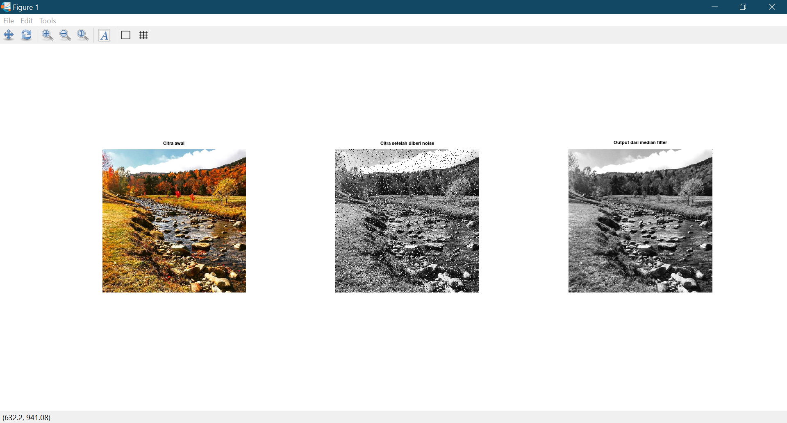

## Anggota Kelompok 8
1. Ana Maria Parasanti (2110131320009)
2. Ferzy Triwarsana Putra (2110131310003)
3. Tio Ezekiel (2110131210018)

---
# Penerapan High-Boost Filtering, Median Filtering & Edge Detection

>## High-Boost Filtering Dengan Function Bawaan Octave

```
% memuat citra awal
img = imread('CitraP6.jfif');

% merubah ke skala keabuan
img = rgb2gray(img);

% fungsi untuk membuat gaussian filtering
G = fspecial('gaussian',5,2.5);

% fungsi untuk memblurkan gambar
img_blur = imfilter(img,G);

% untuk mengurangi buram pada gambar
diff_img = img - img_blur;

highboost_img = img + diff_img;

% menampilkan output
subplot(2,2,1); imshow(img); title('Citra awal')
subplot(2,2,2); imshow(img_blur); title('Citra buram')
subplot(2,2,3); imshow(output); title('Citra hasil dari highboost filter');
```
## Hasilnya:


>## Median Filtering Dengan Function Bawaan Octave
```
% Input gambar
I = imread('CitraMedianFilter.jfif');

% Ubah menjadi skala grayscale jika citra awal belum kelabu
Im = rgb2gray(I);

% Memberi noise (derau) pada citra
noisy = imnoise(Im, 'salt & pepper',0.1);

% Mengaplikasikan median filter
output = medfilt2(noisy);

% Menampilkan output
figure(1);
subplot(1,3,1),imshow(I),title('Citra awal');
subplot(1,3,2),imshow(noisy),title('Citra setelah diberi noise');
subplot(1,3,3),imshow(output),title('Output dari median filter');

```

## Hasilnya:
<p align="center"></p>


>## Edge Detection Dengan Function Bawaan Octave
```
% memuat citra awal
img = imread('CitraP6.jfif');

% merubah ke skala keabuan
img_gray = rgb2gray(img);

% penerapan edge detection sobel
img_edge = edge(img_gray,'sobel');

% menampilkan output
subplot(2,3,1), imshow(img_gray);title('Citra awal');
subplot(2,3,3), imshow(img_edge);title('Edge detection menggunakan Sobel');
```

## Hasilnya:


>## High-Boost Filtering Tanpa Function Octave

```
% Memuat citra awal
awal = imread('CitraP6.jfif');

% Merubah ke skala keabuan
Img = rgb2gray(awal);

% Memberi noise (derau) pada citra
A = imnoise(Img,'Gaussian',0.04,0.003);

I = double(A);

% Desain Kernel Gaussian
% Deviasi Standar
sigma = 1.76;
% Ukuran jendela
sz = 4;
[x,y]=meshgrid(-sz:sz,-sz:sz);

M = size(x,1)-1;
N = size(y,1)-1;
Exp_comp = -(x.^2+y.^2)/(2*sigma*sigma);
Kernel = exp(Exp_comp)/(2*pi*sigma*sigma);

Simpan = zeros(size(I));

I = padarray(I,[sz sz]);

% Konvolusi
for i = 1:size(I,1)-M
    for j =1:size(I,2)-N
        Temp = I(i:i+M,j:j+M).*Kernel;
        Simpan(i,j)=sum(Temp(:));
    end
end

% Citra setelah gaussian filter (buram)
Simpan = uint8(Simpan);

% Penerapan highboost
% Untuk mengurangi buram pada gambar
diff = Img - output;

% Menambahkan perbedaan pada gambar aslinya
hasil = Img + diff;

% Menampilkan gambar
subplot(2,2,1),imshow(Img);title('Citra awal')
subplot(2,2,2),imshow(Simpan);title('Citra buram')
subplot(2,2,3),imshow(hasil);title('Citra hasil dari highboost filter')
```

## Hasilnya:


>## Median Filtering Tanpa Function Octave

```
% Input gambar
I = imread('CitraP6.jfif');

% Ubah menjadi skala keabuan
Im = rgb2gray(I);

% Memberi noise pada citra
noisy = imnoise(Im, 'salt & pepper',0.1);

% Menyimpan ukuran matriks ke dalam dua variabel
[m,n] = size(noisy);

output = zeros(m,n);

% Mengkonversi ukuran matriks ke unsigned 8 bit integer
output = uint8(output);

for i = 1:m
    for j = 1:n
        % Untuk pembatas agar mask filter tidak melebihi dimensi gambar
        xmin = max(1,i-1);
        xmax = min(m,i+1);
        ymin = max(1,j-1);
        ymax = min(n,j+1);
        % Mask filter akan menjadi:
        temp = noisy(xmin:xmax, ymin:ymax);
        output(i,j) = median(temp(:));
    end
end

% Menampilkan output
figure(1);
set(gcf, 'Position', get(0,'ScreenSize'));
subplot(131),imshow(I),title('Original Image');
subplot(132),imshow(noisy),title('noisy Image');
subplot(133),imshow(output),title('output of median filter');

```

## Hasilnya:
<p align="center"></p>


>## Edge Detection Tanpa Function Octave

```
% memuat citra awal
A=imread('CitraP6.jfif');

% merubah ke skala keabuan
B=rgb2gray(A);

C=double(B);

% penerapan edge detection sobel
for i=1:size(C,1)-2
    for j=1:size(C,2)-2
        % perhitungan pada bagian horizontal:
        Gx=((2*C(i+2,j+1)+C(i+2,j)+C(i+2,j+2))-(2*C(i,j+1)+C(i,j)+C(i,j+2)));
        % perhitungan pada bagian vertikal:
        Gy=((2*C(i+1,j+2)+C(i,j+2)+C(i+2,j+2))-(2*C(i+1,j)+C(i,j)+C(i+2,j)));

        % gradien gambar
        B(i,j)=sqrt(Gx.^2+Gy.^2);

    end
end

% menampilkan output
subplot(2,3,1),imshow(A); title('Citra awal');
subplot(2,3,3),imshow(B); title('Edge detection menggunakan Sobel');
```

## Hasilnya:


---
