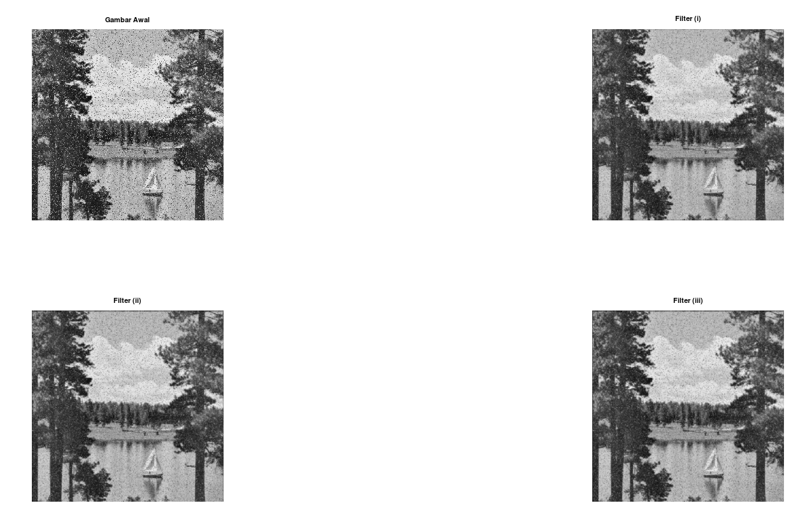
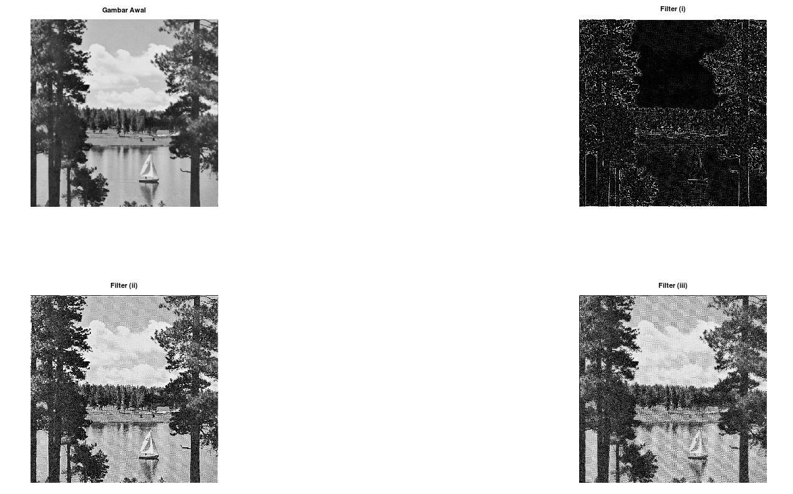
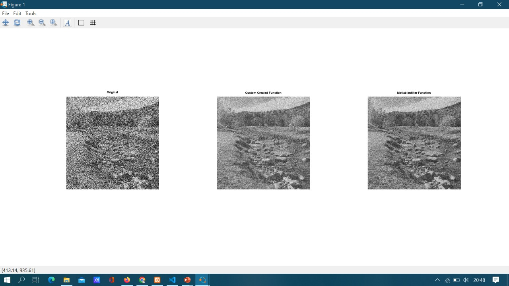
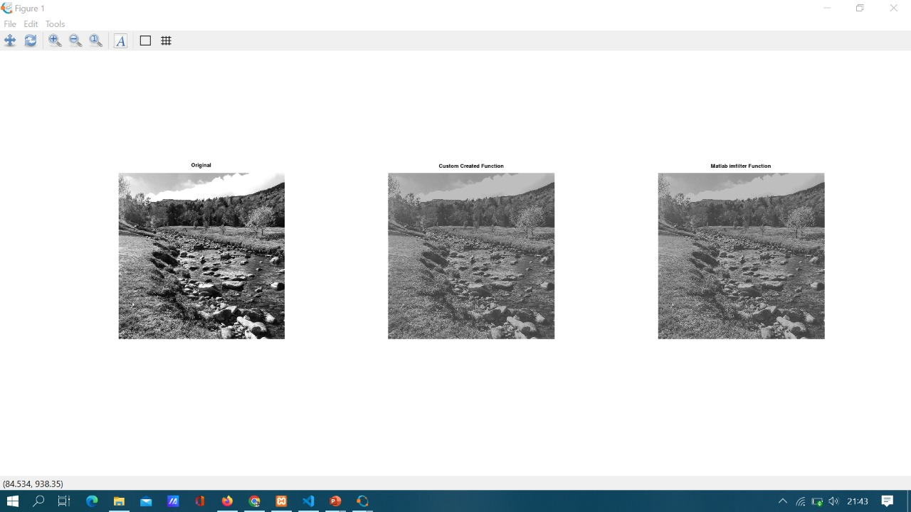

## Anggota Kelompok 8
1. Ana Maria Parasanti (2110131320009)
2. Ferzy Triwarsana Putra (2110131310003)
3. Tio Ezekiel (2110131210018)

---
# Low pass filtering
Proses filter yang melewatkan komponen citra dengan nilai intensitas yang rendah dan meredam komponen citra dengan nilai intensitas yang tinggi. digunakan untuk membuat citra menjadi lebih halus dan lebih blur. Efek pengaburan ini disebut dengan efek blurring.

Ciri-ciri Kernel Low Pass Filtering
* Jumlah semua elemen kernel bernilai satu. 
* Elemen kernel tidak ada yang bernilai negatif. 
* Tinggi dan lebar kernel sama.
* Bobot dalam kernel bersifat simetris terhadap piksel pusat. 

# High Pass Filtering
Proses filter yang mengambil citra dengan gradiasi intensitas yang tinggi dan perbedaan intensitas yang rendah akan dikurangi atau dibuang. High Pass Filtering adalah salah satu dari metode penajaman (sharpening).  Tujuan utama dari proses penajaman ini adalah untuk menyoroti detail-detail halus dalam gambar atau untuk meningkatkan detail yang telah dikaburkan baik dalam kesalahan atau efek alami dari proses akuisisi citra tertentu.

Aturan-aturan dalam high-pass filter
* Koefisien penapis boleh negatif, nol, ataupun bernillai positif.
* Total keseluruhan koefisiennya ialah bernilai 0 ataupun 1.
* Apabila jumlah koefisiennya berjumlah = 0, maka setiap elemen yang rendah frekuensinya nilainya akan menurun. 
* Namun, apabila total dari koefisien adalah = 1, maka elemen yang memiliki frekuensi rendah nilainya tetap sama dengan nilai semula.

# Penerapan Low Pass Filtering dan High Pass Filtering

>## Low Pass Filtering Dengan Function Bawaan Octave

```
im = imread('img\lake.tiff');
noisy = imnoise(im, 'salt & pepper', 0.1);
img = rgb2gray(noisy);

lowpass1 = [1/16 1/8 1/16;1/8 1/4 1/8;1/16 1/8 1/16];
lowpass2 = [1/10 1/10 1/10;1/10 1/5 1/10;1/10 1/10 1/10];
lowpass3 = [1 1 1;1 1 1;1 1 1]/9;

h1 = uint8(conv2(double(img),lowpass1,'same'));
h2 = uint8(conv2(double(img),lowpass2,'same'));
h3 = uint8(conv2(double(img),lowpass3,'same'));

subplot(2,2,1);imshow(img);title("Gambar Awal");
subplot(2,2,2);imshow(h1);title("Filter (i)");
subplot(2,2,3);imshow(h2);title("Filter (ii)");
subplot(2,2,4);imshow(h3);title("Filter (iii)");
```
## Hasilnya:
<p align="center"></p>

>## High Pass Filtering Dengan Function Bawaan Octave
```
im = imread('img\lake.tiff');
img = rgb2gray(im);

hpf1 = [-1 -1 -1; -1 8 -1; -1 -1 -1];
hpf2 = [0 -1 0; -1 5 -1; 0 -1 0];
hpf3 = [1 -2 1; -2 5 -2; 1 -2 1];

J1 = uint8(conv2(double(img),hpf1,'same'));
J2 = uint8(conv2(double(img),hpf2,'same'));
J3 = uint8(conv2(double(img),hpf3,'same'));

subplot(2,2,1);imshow(img);title("Gambar Awal");
subplot(2,2,2);imshow(J1);title("Filter (i)");
subplot(2,2,3);imshow(J2);title("Filter (ii)");
subplot(2,2,4);imshow(J3);title("Filter (iii)");
```

## Hasilnya:
<p align="center"></p>

>## High Pass Filtering Dengan Function Bawaan Octave

>## Low Pass Filtering dan High Pass Filtering Tanpa Function Octave

Berikut adalah functionnya
```
function B = lowdanhigh(A, k)
    [ky, kx] = size(k);             % ukuran kernel
    im_pad = padarray(A, [kx ky]);
    [y, x] = size(im_pad);          % ukuran citra asli
    B = zeros(x,y);         % membuat matriks kosong utk menyimpan output
    kr = rot90(k);          % memutar kernel 180 derajat utk konvolusi
    kr = rot90(kr);
    for i=(1+ky):(y-ky)         % indeks sepanjang tiap baris pada citra asli
        for j=(1+kx):(x-kx)     % indeks sepanjang tiap piksel pada citra asli
            % membuat local neighborhood
            neigh = im_pad(i-floor(ky/2):i+floor(ky/2), j-floor(kx/2):j+floor(kx/2));
            accumulator = 0;
            for u=1:ky      % indeks sepanjang tiap baris pada kernel
                for v=1:kx  % indeks sepanjang tiap element pada kernel
                    if(i>ky && i<y-ky && j>kx && j<y-kx)
                    temp = neigh(u,v)*kr(u,v);
                    accumulator = accumulator + temp;
                    end
                end
            end
            %Tetapkan nilai piksel pada citra baru dengan hasil operasi konvolusi
            B(i,j) = accumulator;
        end
    end
    B=B(1+ky:y-ky,1+kx:x-kx);       % Hapus padding gambar
end
```

Berikut adalah penerapannnya
```
% memuat citra awal
im = imread('gmbrnoise.jpg');
A = rgb2gray(im); % merubah ke skala keabuan
A = double(A);

% memuat citra awal
img = imread('CitraP6.jfif');
B = rgb2gray(img); % merubah ke skala keabuan
B = double(B);

% matriks kernel low dan high pass
Kernel_low = (1/9)*ones(3);
Kernel_high = [0 -1 -1 -1 0; -1 2 -4 2 -1; -1 -4 13 -4 -1; -1 2 -4 2 -1; 0 -1 -1 -1 0];

% melakukan konvolusi pada citra menggunakan kernel
img_out = lowdanhigh(A,Kernel_low);
img_out2 = lowdanhigh(B,Kernel_high);

% menampilkan output
%figure('color','w')
subplot(2,2,1); imshow(B,[]); title('Citra awal')
subplot(2,2,3); imshow(im,[]); title('Citra noise')
subplot(2,2,4); imshow(img_out,[]); title('Output menggunakan kernel low pass filter')
subplot(2,2,2); imshow(img_out2,[]); title('Output menggunakan kernel high pass filter')
```

## Hasilnya:

### Low Pass Filter
<p align="center"></p>

### High Pass Filter
<p align="center"></p>
---
