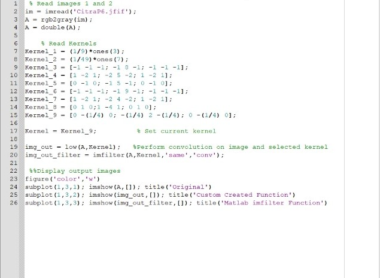
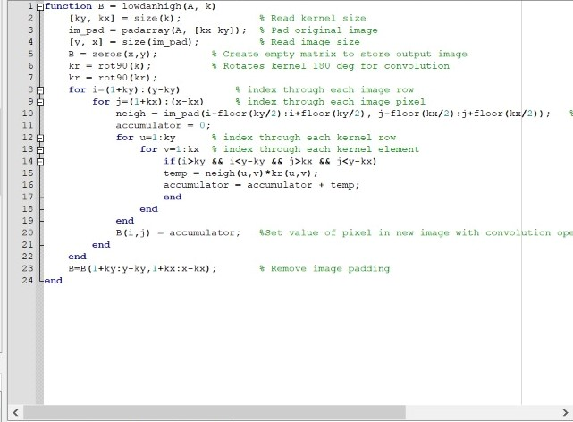

## Anggota Kelompok 8
1. Ana Maria Parasanti
2. Ferzy Triwarsana Putra
3. Tio Ezekiel

# Penerapan Low Pass Filtering dan High Pass Filtering

>## Low Pass Filtering Dengan Function Bawaan Octave

>## Low Pass Filtering Tanpa Function Octave

## Hasilnya:

>## High Pass Filtering Dengan Function Bawaan Octave

>## High Pass Filtering Tanpa Function Octave

## Hasilnya:

