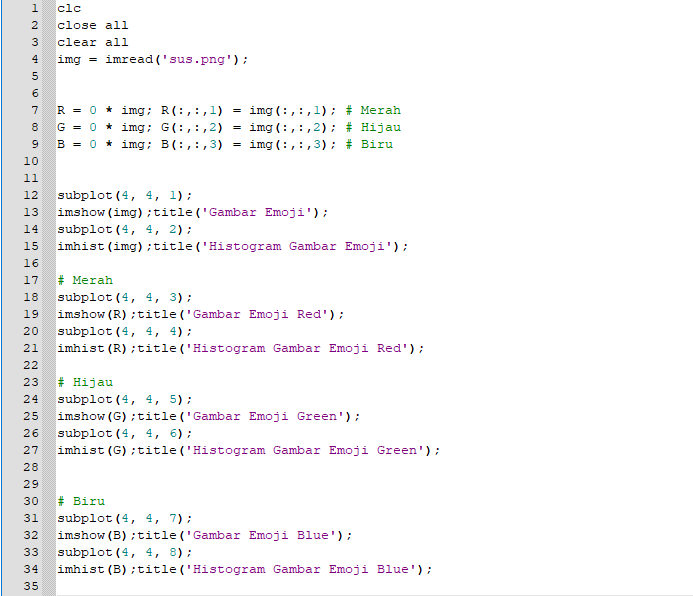
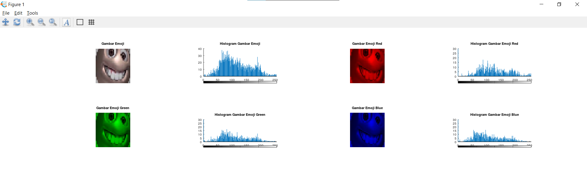
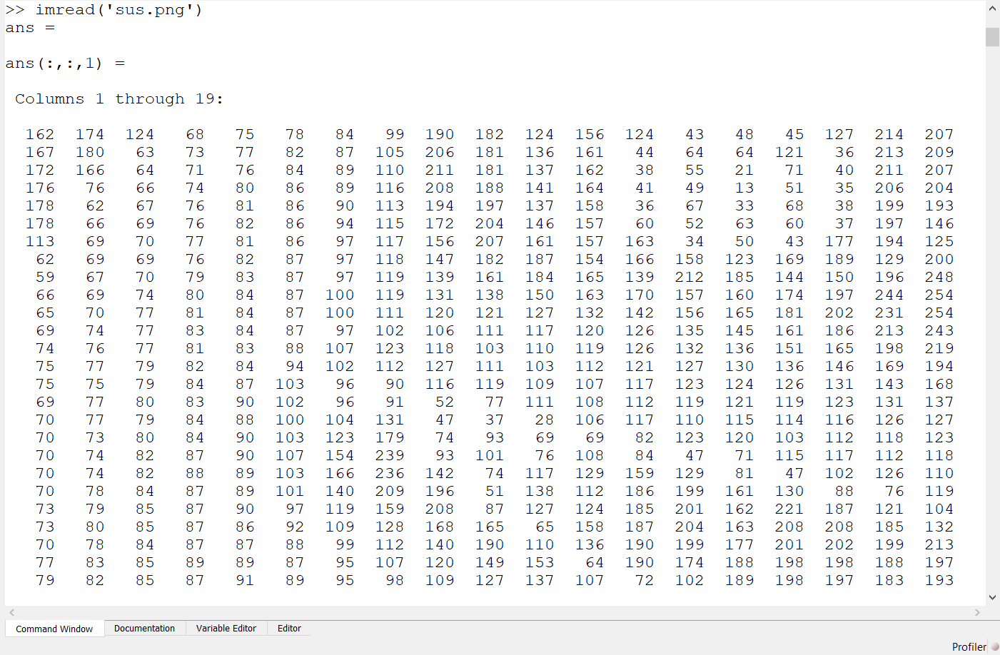
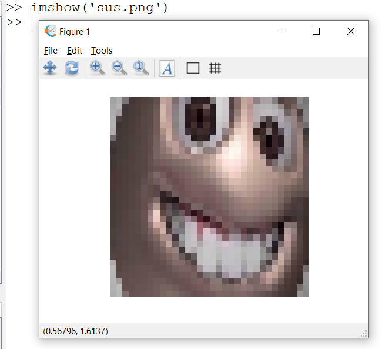
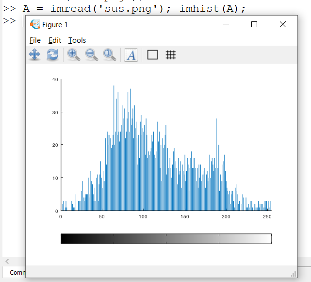

**Tio Ezekiel | 2110131210018 | Tugas 2 PCD**

># Eksplorasi Layer Pada Gambar

Ada 3 layer utama pada sebuah gambar. Yaitu Red (merah), Green (hijau), dan Blue (biru) atau sering juga dikenal dengan RGB.

Untuk mengambil layer warna dari sebuah gambar dengan Octave dapat digunakan code berikut:

```
Red     = 0 * img; R(:,:,1) = img(:,:,1); # Untuk warna merah
Green   = 0 * img; G(:,:,2) = img(:,:,2); # Untuk warna hijau
Blue    = 0 * img; B(:,:,3) = img(:,:,3); # Untuk warna biru
```

Berikut adalah hasil eksplorasi saya dalam mengambil ketiga layer warna pada sebuah gambar.

============================================================================================

Gambar yang saya gunakan berukuran 32x32 seperti ini: 

Berikut screenshot Editor Octave:

<p align="center"></p>

Dan berikut hasil kode sudah dijalankan:

<p align="center"></p>

># Fungsi imread, imshow, imhist

## 1. imread

imread adalah method untuk memuat gambar dari file yang ditentukan. Method ini digunakan untuk membaca citra menjadi sebuah data matriks.


Berikut adalah screenshot di Command Windows Octave ketika imread dijalankan pada gambar 32x32 tadi.
<p align="center"></p>

## 2. imshow

imshow menampilkan gambar dengan cara membaca data matriks pada sebuah gambar dan menampilkannya secara visual.

Berikut adalah screenshot di Command Windows Octave ketika imshow dijalankan pada gambar 32x32.

<p align="center"></p>

## 3. imhist

Singkatnya imhist menghitung intensitas grayscale pada matriks yang telah dibaca oleh imread tadi menjadi sebuah histogram.

Berikut adalah screenshot di Command Windows Octave ketika imhist dijalankan pada gambar 32x32 tadi.

<p align="center"></p>