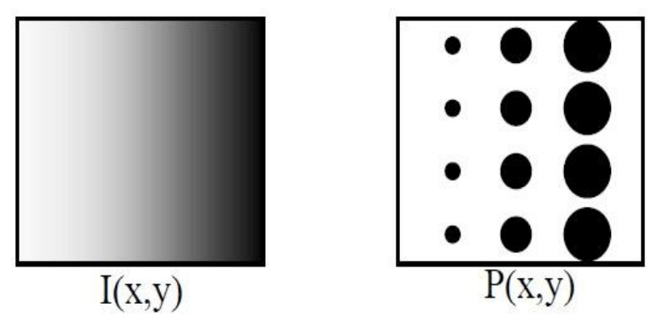
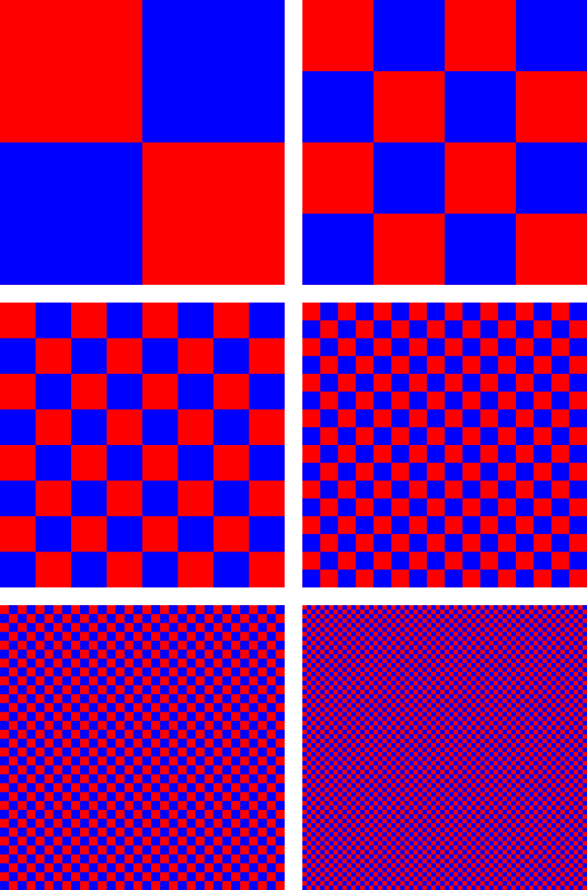

# Halftoning

**Halftone** adalah teknik reprografi yang mensimulasikan citra nada terus menerus melalui penggunaan titik-titik, bervariasi baik dalam ukuran, bentuk atau jarak.

"Halftone" juga dapat digunakan untuk merujuk secara khusus ke gambar yang dihasilkan oleh proses ini.

Sistem visual manusia memiliki kecenderungan untuk meratakan kecerahan di area kecil, sehingga titik-titik hitam dan latar belakang putihnya bergabung dan dianggap sebagai warna abu-abu menengah.

Proses menghasilkan pola biner titik hitam dan putih dari sebuah gambar disebut **halftoning**.

- Kanan: Titik halfton. 
- Kiri: Bagaimana mata manusia akan melihat jenis pengaturan ini dari jarak yang cukup.
- Menggunakan titik-titik dengan berbagai ukuran untuk menyatakan intensitas
- Luas titik sebanding dengan intensitas dalam gambar

# Patterning

Teknik halftoning digital sederhana yang dikenal sebagai **patterning** melibatkan penggantian setiap piksel dengan pola yang diambil dari 'font biner'. Font ini dapat digunakan untuk mencetak gambar yang terdiri dari sepuluh tingkat keabuan.

# Dithering

Dithering dipakai dalam grafika komputer untuk memberikan ilusi kedalaman warna tinggi dengan menggunakan palet terbatas (kuantisasi warna). Caranya adalah dengan membuat rata-rata bagian citra sama dengan rata-rata pada bagian citra asalnya. Penglihatan manusia melihat warna-warna yang berdekatan sebagai campuran warna-warna tersebut. Layar televisi dan komputer menggunakan cara sifat pencampuran warna untuk menampilkan citra berwarna dengan fosfor tiga warna.

 

 - Warna yang dipakai hanyalah merah dan biru. Namun, seiring kotak-kotak itu diperkecil, dua warna tersebut tampak berwarna ungu.