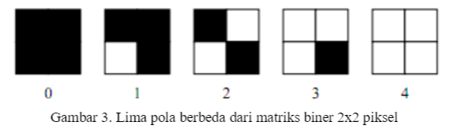
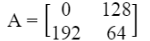

# Halftoning

**Halftone** adalah teknik reprografi yang mensimulasikan citra nada terus menerus melalui penggunaan titik-titik, bervariasi baik dalam ukuran, bentuk atau jarak.

"Halftone" juga dapat digunakan untuk merujuk secara khusus ke gambar yang dihasilkan oleh proses ini.

Sistem visual manusia memiliki kecenderungan untuk meratakan kecerahan di area kecil, sehingga titik-titik hitam dan latar belakang putihnya bergabung dan dianggap sebagai warna abu-abu menengah.

Proses menghasilkan pola biner titik hitam dan putih dari sebuah gambar disebut **halftoning**.

- Kanan: Titik halfton. 
- Kiri: Bagaimana mata manusia akan melihat jenis pengaturan ini dari jarak yang cukup.
- Menggunakan titik-titik dengan berbagai ukuran untuk menyatakan intensitas
- Luas titik sebanding dengan intensitas dalam gambar

# Patterning

Teknik halftoning digital sederhana yang dikenal sebagai **patterning** melibatkan penggantian setiap piksel dengan pola yang diambil dari 'font biner'. Font ini dapat digunakan untuk mencetak gambar yang terdiri dari sepuluh tingkat keabuan.

Patterning menghasilkan gambar halftoning digital dari gambar input menggunakan teknik pola. Pola program membaca gambar input, mengkuantisasi nilai piksel, dan memetakan setiap piksel ke pola yang sesuai. Gambar yang dihasilkan 16 kali lebih besar dari aslinya. Gambar yang dihasilkan ditulis ke file output sebagai file TIFF. Sebuah kata peringatan: "pola" membutuhkan banyak perhitungan, gambar berukuran kurang dari 100x100 direkomendasikan

# Dithering

Dithering atau pembauran galat dipakai dalam grafika komputer untuk memberikan ilusi kedalaman warna tinggi dengan menggunakan palet terbatas (kuantisasi warna). Caranya adalah dengan membuat rata-rata bagian citra sama dengan rata-rata pada bagian citra asalnya. Penglihatan manusia melihat warna-warna yang berdekatan sebagai campuran warna-warna tersebut. Layar televisi dan komputer menggunakan cara sifat pencampuran warna untuk menampilkan citra berwarna dengan fosfor tiga warna.

Sederhananya, algoritme dithering mencatat selisih warna (galat) yang dipilih dengan warna aslinya dan menambahkan selisih tersebut ke piksel tetangganya sebelum mencari palet warna terdekat untuknya. Dengan membaurkan galat-galat ini, hasil pengurangan warna (kuantisasi) masih tampak mirip dengan asalnya. Meski demikian, apabila jumlah warna terlalu sedikit (kedalaman warna yang terlalu dangkal), pola deraunya bisa saja terlihat.

Ada beberapa sebab yang dapat memengaruhi kualitas citra yang dikurangi jumlah warnanya. Salah satunya adalah palet warna yang dipilih. Sebagai contoh, citra asal (Gambar 1) dapat dikurangi menjadi 216 warna aman untuk web. Jika tiap piksel pada citra asal langsung diganti menjadi warna terdekat pada palet tersebut, tidak ada pembauran galat yang dilakukan (Gambar 2). Namun, biasanya cara ini menghasilkan wilayah datar (kontur) dan kehilangan detail sehingga dapat terlihat cukup jauh dari asalnya. Bagian bergradasi dapat menghasilkan pemitaan warna yang cukup mengganggu. Penerapan pembauran galat dapat meminimalkan artefak visual dan lebih mencirikan citra asal (Gambar 3). Pembauran galat dapat mengurangi pemitaan warna dan daerah datar.

Salah satu masalah yang muncul akibat palet warna yang tetap adalah warna yang dibutuhkan bisa saja tidak tersedia pada palet dan banyak warna yang ada tidak diperlukan. Misalnya, palet yang berisi banyak warna hijau kurang cocok untuk foto padang pasir. Penggunaan palet warna optimal dapat membantu untuk kasus ini. Palet warna optimal dibuat berdasarkan warna-warna yang paling sering muncul. Apabila citra asal dikurangi dengan palet warna optimal, hasilnya lebih mirip dengan citra asal (Gambar 4).

Jumlah warna yang tersedia dalam palet juga menjadi salah satu sebab yang memengaruhi kualitas citra. Misal, jika warnanya hanya ada enam belas, citra hasil pengurangannya akan semakin kehilangan detail dengan lebih banyak daerah datar dan pemitaan warna (Gambar 5). Sekali lagi, pembauran galat dapat mengurangi artefak tersebut (Gambar 6).

- Warna yang dipakai hanyalah merah dan biru. Namun, seiring kotak-kotak itu diperkecil, dua warna tersebut tampak berwarna ungu.

# Penerapan 3 Method Grayscale (Lightness, Average, Luminosity)

Diterapkan 3 method untuk mengubah gambar berwarna ke gambar kelabu (grayscale). Ketiga method tersebut adalah:
1. Lightness Method    : ((min(R, G, B)) + (max (R, G, B))) / 2
2. Average Method      : (R + G + B) / 3
3. Luminosity Method   : (0.21 * R) + (0.72 * G) + (0.07 * B)

Dari gambar di atas dapat terlihat bahwa method Luminosity memberikan hasil grayscale yang terbaik.

Sedangkan pada Lightness dan Average warna nampak terlalu cerah dan terlalu gelap.

># Algoritma Threshold Pada Dithering

Thresholding adalah proses mengubah citra berderajat keabuan menjadi citra biner atau hitam putih sehingga dapat diketahui daerah mana yang termasuk obyek dan background dari citra secara jelas. Citra hasil thresholding biasanya digunakan lebih lanjut untuk proses pengenalan obyek serta ekstraksi fitur.

Thresholding juga di mana saat tiap piksel dibandingkan dengan nilai ambang tertentu. Cara ini adalah cara termudah daripada yang lain. Namun, hasilnya memiliki kekurangan detail yang besar.

Singkatnya thresholding merupakan salah satu metode segmentasi citra di mana prosesnya didasarkan pada perbedaan derajat keabuan citra.

Random dithering adalah usaha awal (seawal-awalnya tahun 1951) untuk mengurangi dampak akibat pengambangan biasa. Tiap piksel dibandingkan dengan nilai ambang acak sehingga menghasilkan citra yang berderau statis. Meski cara ini tidak menghasilkan artefak berpola, deraunya lebih sering merusak citra.

Digunakan rumus berikut untuk menentukan thresholding:

># Halftoning Citra Menggunakan Metode Ordered Dithering

Untuk alasan efisiensi, beberapa teknologi rendering yang ada saat ini hanya mampu menampilkan sejumlah tingkat keabuan yang terbatas. Salah satu contoh peralatannya adalah printer yang hanya mampu  menampilkam  warna  hitam  dan  putih  untuk  gambar  monokrom.  Gambar  monokrom dengan  hanya  menggunakan  dua gray level, yaitu  hitam  dan  putih  ini  sangat  mempengaruhi kualitas  gambar  yang  dihasilkan.  Metode ini dilakukan dengan mengeksploitasi sifat dari sistem visual manusia  dalam  memberikan  kesan  bahwa  citra  tersebut  sifatnya  kontinu  pada  semua  detail  citra meskipun hanya memiliki dua tingkat dalam rendering.

## Metode Ordered Dithering dan Hasil Simulasi

Karena  sistem  visual  manusia  cenderung  meratakan  suatu areadi  sekitar  piksel, bukan   melihat   setiap   piksel   secara   sendiri-sendiri,   sehingga   memungkinkan   untuk membuat  ilusi  dari  beberapa  tingkat  keabuan  di  dalam  sebuah  citra  biner  yang  dalam kenyataannya  hanya  terdiri  dari  dua  tingkat  abu-abu. Dengan  menggunakan  matriks  2x2 piksel,  lima  nilai  intensitas  “efektif”  yang  berbeda  dapat  terwakili,  seperti   yang diilustrasikan  pada Gambar 3.  Demikian  juga  dengan  matriks  4x4  piksel,  sepuluh  buah tingkat kabuan yang berbeda dapat terwakili. Metode ini disebut dengan dithering, dalam proses dithering blok  asli  pada  citra  kemudian  akan  diganti  dengan  jenis  pola  biner tersebut 

Ordered dithering dilakukan  dengan  membandingkan  tiap  blok  dari  citra  asli dengan sebuah matriks  pembatas  yang  disebut  dengan matriks dither. Masing-masing elemen  dari  blok  asli  dikuantisasi  sesuai  dengan  nilai  batas  pada  pola dither.  Nilai-nilai pada matriks dither adalah tetap, tetapi bisa bervariasi sesuai dengan jenis citra. Matriks dither pertama yang digunakan dalam metode ini adalah:

Matriks  tersebut  diulang  sampai  mencakup  seluruh  matriks  pada  citra  yang  diolah. Katakanlah  d(i,j)  adalah  matriks  yang  diperoleh  dari  mereplika  A  dan  x(i,j)  adalah  citra abu-abu asli. Piksel untuk citra yang dihasilkan p(i,j) didefinisikan sebagai berikut:

Hasil  konversi  citra  abu-abu  pada Gambar  1  menggunakan  metode ordered ditheringmenggunakan matriks dither 2 x 2, ditunjukkan pada Gambar 4.

Selain matriks 2x2, teknik ini juga memiliki matriks dithering yang lainnya, yaitu 4x4 sebagai berikut

Gambar 5 menunjukkan citra yang dihasilkan dari penggunaan ordered dithering matriks 4x4

## Kesimpulan
Konversi citra dari citra abu-abu dengan tingkat keabuan 256 menjadi citra biner dengan  dua  tingkat  keabuan  perlu  dilakukan  untuk  memenuhi  kebutuhan  akan  piranti yang hanya men-support citra  biner.  Metode  konversi  yang  sederhana  seperti  metode ambang  batas  (thresholding)  kurang dapat mengkonversi  citra  tersebut  dengan  cukup baik.  Keterbatasan  tersebut  dapat  diperbaiki  dengan  metode ordered dithering yang mampu memberikan kesan keabuan, detail, dan kualitas yang lebih baik pada suatu citra biner
