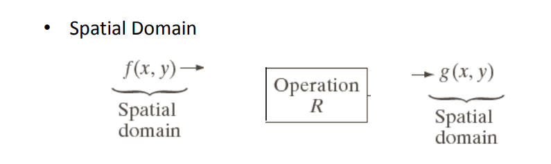
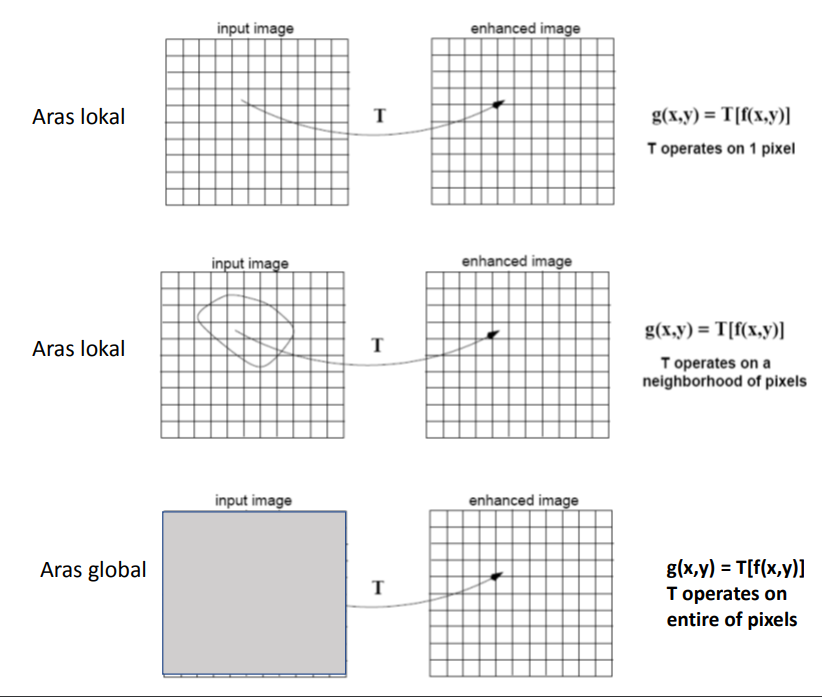
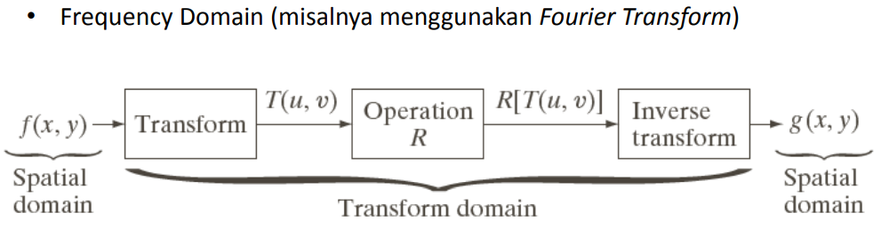
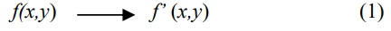
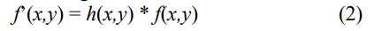

# IMAGE ENHANCEMENT

>## Pendahuluan

*Image Enhancement* adalah proses mendapatkan
citra yang lebih mudah diinterpretasikan oleh mata
manusia (*Human Visual System*/HVS). Proses ini
merupakan salah satu proses awal dalam pengolahan
citra (image preprocessing). Untuk meningkatkan
kualitas hasil proses image enhancement maka lebih
baik manipulasi citra dilakukan dalam domain
frekuensi.
Dalam domain spasial sudah kita ketahui salah satu metodenya yakni *Bit Plane Slicing*.

Proses-proses yang termasuk ke dalam perbaikan kualitas citra:
- Pengubahan kecerahan gambar (image brightening)
- Citra negatif (image negatives)
- Peregangan kontras (contrast stretching)
- Pengubahan histogram citra.
- Pelembutan citra (image smoothing)
- Penajaman (sharpening) tepi (edge).
- Pewarnaan semu (pseudocolouring)
- Pengubahan geometrik

Image enhancement juga bisa disebut perbaikan kuaitas citra.
- Tujuan: memperoleh citra yang lebih sesuai digunakan untuk aplikasi lebih
lanjut (misal: mengenali objek di dalam citra).
- Merupakan satu proses awal dalam pengolahan citra (preprocessing)
- Mengapa memerlukan image enhancement?
1. citra mengandung derau (noise)
2. citra terlalu terang/gelap, citra kurang tajam, kabur (blur)
3. cacat saat akuisisi citra:
- lensa: object blurring atau background blurring
- objek bergerak kamera bergerak: motion blurring
4. Distorsi geometrik disebabkan oleh lensa atau sudut pengambilan

## Berdasarkan ranah (domain) operasinya, metode-metode untuk perbaikan kualitas citra dapat dikelompokkan menjadi dua kategori:
1. **Image enhancement dalam ranah spasial**

2. **Image enhancement dalam ranah frekuensi**

Pada proses perbaikan kualitas citra, ciri-ciri
tertentu dalam citra lebih diperjelas kemunculannya.
Secara matematis:

Proses pelembutan dan penajaman citra merupakan operasi penapisan (filtering), sehingga dilakukan operasi konvolusi citra f(x,y) dan filter h(x,y). Secara matematis dalam domain spasial dirumuskan sebagai berikut:

dan dalam domain frekuensi:

- Metode-metode image enhancement dalam ranah spasial dilakukan
dengan memanipulasi secara langsung pixel-pixel di dalam citra.
- Metode-metode image enhancement dalam ranah frekuensi
dilakukan dengan mengubah citra terlebih dahulu dari ranah spasial
ke ranah frekuensi, baru kemudian memanipulasi nilai-nilai frekuens
tersebut.
- Masing-masing ranah operasi digunakan untuk tujuan spesifik, karena
tidak semua perbaikan citra dapat dilakukan dalam ranah spasial.
- Materi di dalam PPT ini membahas metode-metode image
enhancement dalam ranah spasial terlebih dahulu.