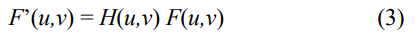

# IMAGE ENHANCEMENT

>## Pendahuluan

*Image Enhancement* adalah proses mendapatkan
citra yang lebih mudah diinterpretasikan oleh mata
manusia (*Human Visual System*/HVS). Proses ini
merupakan salah satu proses awal dalam pengolahan
citra (image preprocessing). Untuk meningkatkan
kualitas hasil proses image enhancement maka lebih
baik manipulasi citra dilakukan dalam domain
frekuensi.
Dalam domain spasial sudah kita ketahui salah satu metodenya yakni *Bit Plane Slicing*.

Pada proses perbaikan kualitas citra, ciri-ciri
tertentu dalam citra lebih diperjelas kemunculannya.
Secara matematis:

Pada proses pelembutan dan penajaman citra merupakan operasi penapisan (filtering), sehingga dilakukan operasi konvolusi citra f(x,y) dan filter h(x,y). Secara matematis dalam domain spasial dirumuskan sebagai berikut:

dan dalam domain frekuensi:

