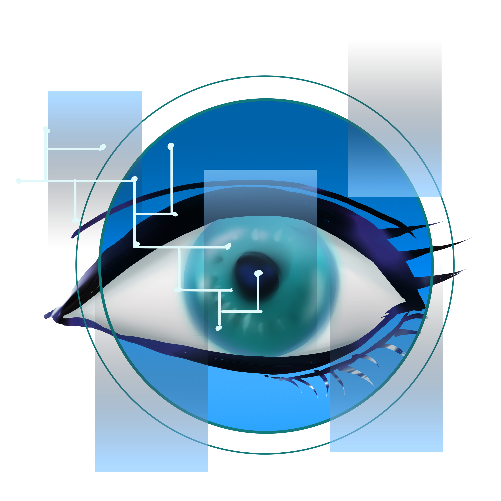

Anggota kelompok :
1. Ady Mutalib : 2110131110003
2. Tio Ezekiel : 2110131210018

<H1 align="center">Retinal Scan (Pemindai Retina)</H1>

Pemindaian retina atau retinal scan adalah teknik biometrik yang menggunakan pola unik pada pembuluh darah retina seseorang. Jangan bingung dengan teknologi berbasis okular lainnya: pengenalan iris, yang biasa disebut "pemindaian iris", dan verifikasi vena mata yang menggunakan vena sklera.

><h2>Pengenalan</h2>

Retina manusia adalah jaringan tipis yang terdiri dari sel-sel saraf yang terletak di bagian posterior mata. Karena struktur kompleks kapiler yang memasok darah ke retina, retina setiap orang adalah unik, membuat pemindaian retina menjadi metode otentikasi yang baru muncul. Jaringan pembuluh darah di retina tidak sepenuhnya ditentukan secara genetik dan dengan demikian bahkan kembar identik pun tidak memiliki pola yang sama.

Meskipun pola retina dapat berubah dalam kasus diabetes, glaukoma atau gangguan degeneratif retina, retina biasanya tetap tidak berubah dari lahir sampai kematian. Karena sifatnya yang unik dan tidak berubah, retina tampaknya merupakan biometrik yang paling tepat dan andal, selain DNA. Pusat Nasional untuk Pengadilan Negeri memperkirakan bahwa pemindaian retina memiliki tingkat kesalahan satu dari sepuluh juta.

><h2>Sejarah</h2>

Pemindaian retina dilakukan dengan memancarkan sinar inframerah berenergi rendah yang tidak terlihat ke mata seseorang saat mereka melihat melalui lensa mata pemindai. Sinar cahaya ini menelusuri jalur standar pada retina. Karena pembuluh darah retina menyerap cahaya lebih mudah daripada jaringan di sekitarnya, jumlah pantulan bervariasi selama pemindaian. Pola variasi didigitalkan dan disimpan dalam database.
